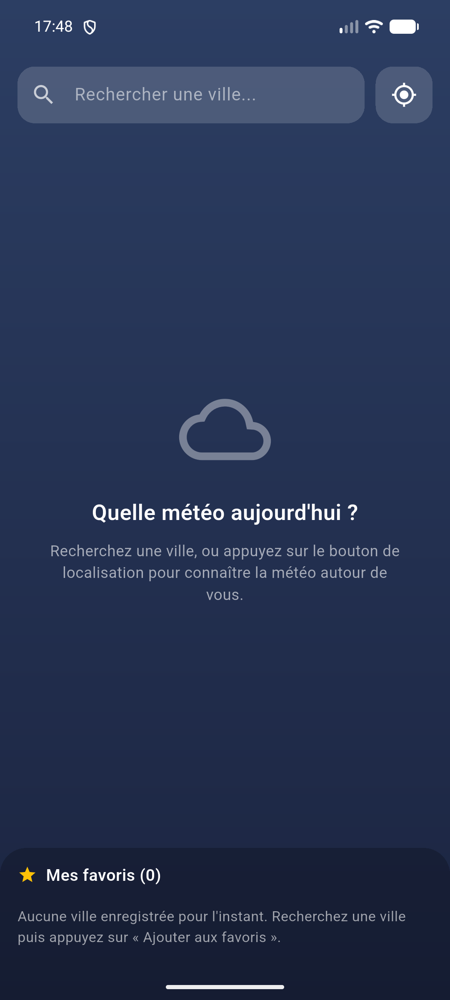
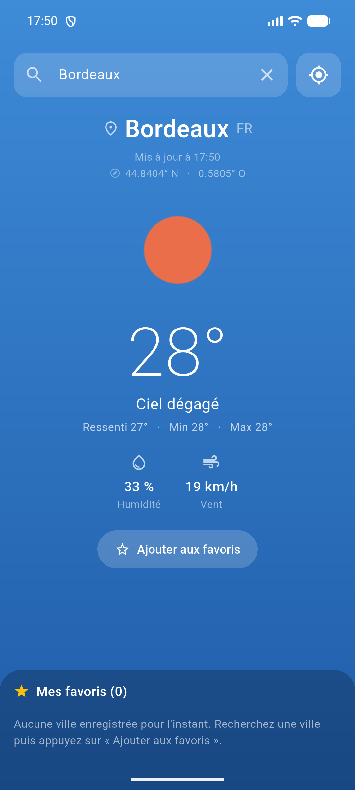
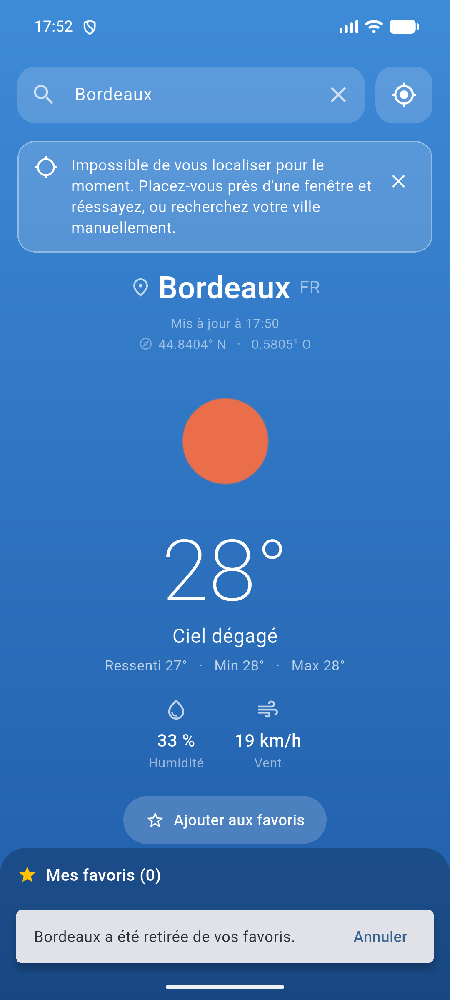
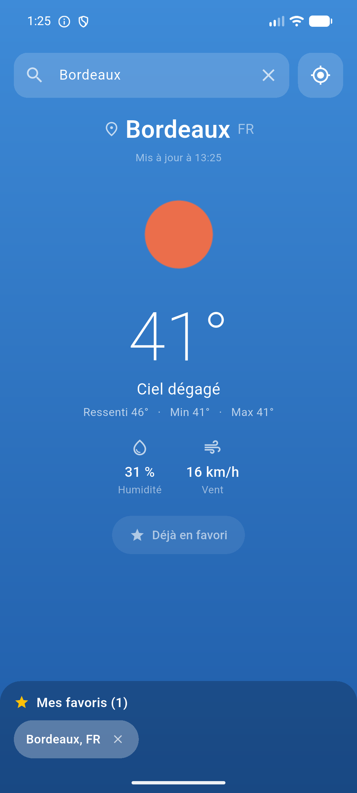
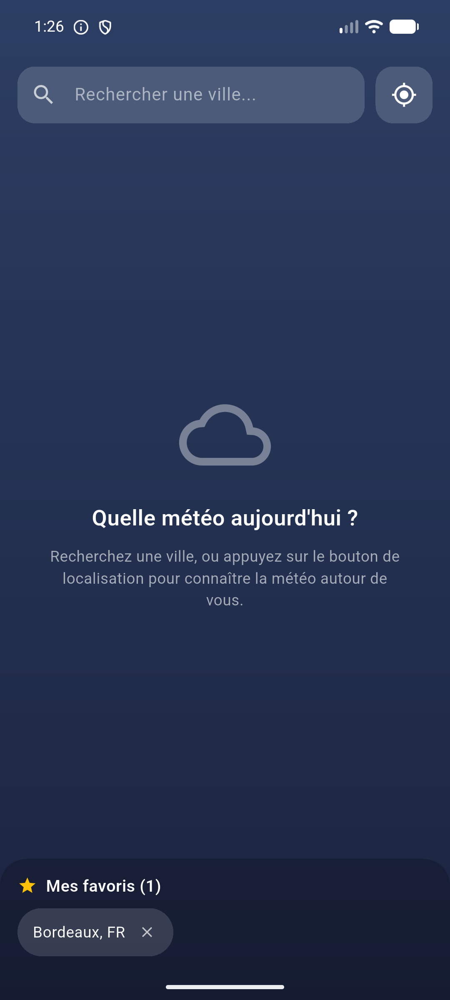
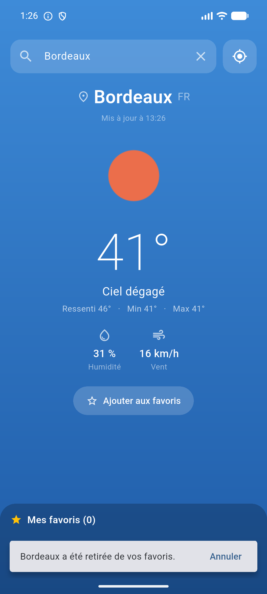
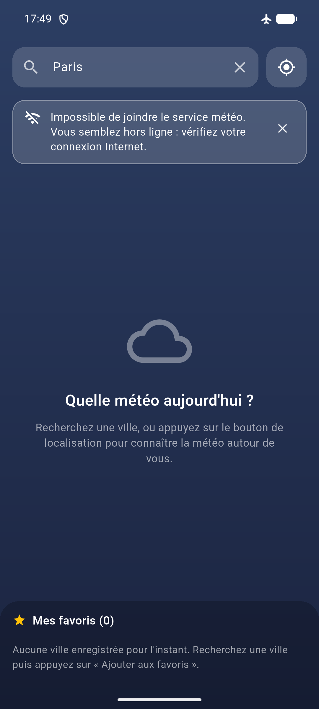
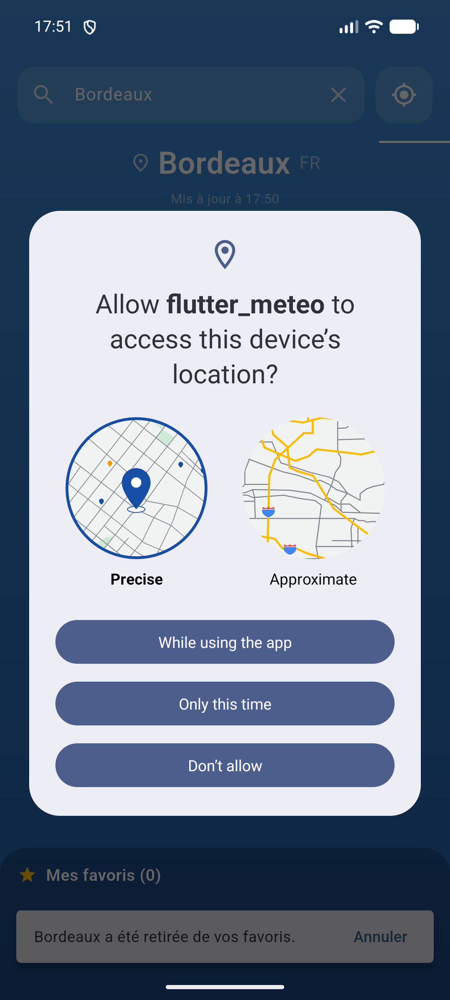
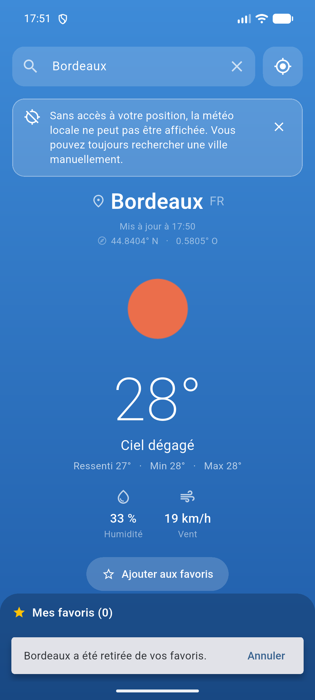

# Application Météo — TP Flutter

Application Flutter consommant l'API [OpenWeatherMap](https://openweathermap.org/).
Elle permet de rechercher la météo d'une ville, d'utiliser la position GPS de
l'appareil, et de conserver une liste de villes favorites d'un lancement à
l'autre.

---

## 1. Lancer le projet

La clé API n'est **jamais** écrite dans le code : elle est injectée au
lancement depuis un fichier local, lui-même exclu de Git.

```bash
# 1. Créer son fichier de clé à partir du modèle
cp example.env .env
#    puis y coller sa clé OpenWeatherMap

# 2. Installer les dépendances
flutter pub get

# 3. Lancer
flutter run --dart-define-from-file=.env
```

### Sur émulateur Android

```bash
flutter emulators                              # lister les émulateurs
flutter emulators --launch Flutter_Pixel_API36 # en démarrer un
flutter run -d emulator-5554 --dart-define-from-file=.env
```

L'application a été validée sur un Pixel API 36 (Android 16).

> `--dart-define` étant résolu **à la compilation**, un APK déjà installé
> conserve la clé qui lui a été fournie : après avoir modifié `.env`, il
> faut relancer `flutter run` ou `flutter build`, un simple redémarrage de
> l'application ne suffit pas.

Si l'application est lancée sans ce fichier, elle ne plante pas : elle affiche
un bandeau expliquant que la clé est manquante et rappelant la commande.

> Une clé OpenWeatherMap fraîchement créée peut mettre jusqu'à 2 heures avant
> d'être activée ; en attendant, l'API répond `401` et l'application affiche le
> message correspondant.

### Tests

```bash
flutter test      # 25 tests : modèles, appels API, erreurs, parcours utilisateur
flutter analyze   # aucune erreur, aucun avertissement
```

Les tests n'ont pas besoin de la clé API : ils injectent un client HTTP simulé
(`MockClient`) dans `WeatherApi`.

---

## 2. Fonctionnalités

| Attendu | Où c'est implémenté |
|---|---|
| Champ de recherche + bouton | [`lib/widgets/search_field.dart`](lib/widgets/search_field.dart) — la touche « entrée » du clavier déclenche la même action |
| Bouton GPS | [`lib/services/location_service.dart`](lib/services/location_service.dart) + permissions par plateforme |
| Nom de la ville, température (°C), icône de l'API, description | [`lib/widgets/weather_card.dart`](lib/widgets/weather_card.dart) |
| Favoris persistants, affichés en bas | [`lib/widgets/favorites_list.dart`](lib/widgets/favorites_list.dart) + [`lib/services/favorites_store.dart`](lib/services/favorites_store.dart) |
| Suppression d'un favori | Croix sur chaque puce, avec possibilité d'annuler |
| Clic sur un favori = météo actuelle | `_openFavorite` dans [`lib/screens/home_screen.dart`](lib/screens/home_screen.dart) — relance un appel API, ne relit **jamais** une température stockée |

En plus du minimum demandé : ressenti, min/max, humidité, vent, heure de mise à
jour, coordonnées du point interrogé, et un dégradé de fond qui s'adapte à la
condition météo et au jour/nuit.

> Les coordonnées ne font pas partie des quatre champs exigés — le sujet ne les
> mentionne que comme *moyen* d'interroger l'API. Elles sont affichées parce
> qu'elles rendent le résultat d'une géolocalisation vérifiable d'un coup d'œil.

### Détails de l'appel API

`https://api.openweathermap.org/data/2.5/weather` avec `units=metric` (°C) et
`lang=fr` (descriptions en français). Les icônes viennent directement de
`https://openweathermap.org/img/wn/{code}@4x.png`.

---

## 3. Gestion des erreurs

Toute erreur technique (code HTTP, socket, timeout, JSON invalide, permission
refusée) est convertie en un objet `AppFailure` porteur d'un message **déjà
rédigé en français**. L'interface se contente de l'afficher dans un bandeau.

| Situation | Message affiché |
|---|---|
| Champ vide | « Saisissez le nom d'une ville avant de lancer la recherche. » |
| Ville inconnue (404) | « Cette ville est introuvable. Vérifiez l'orthographe, ou précisez le pays (par exemple « Rennes, FR »). » |
| Hors ligne / serveur injoignable | « Impossible de joindre le service météo. Vous semblez hors ligne : vérifiez votre connexion Internet. » |
| Clé absente | « Aucune clé API n'a été fournie au lancement… » + la commande à utiliser |
| Clé refusée (401) | « La clé API a été refusée… une clé fraîchement créée peut mettre jusqu'à 2 heures à s'activer. » |
| Quota dépassé (429) | « Trop de recherches en peu de temps… Patientez une minute. » |
| Position refusée | « Sans accès à votre position, la météo locale ne peut pas être affichée. Vous pouvez toujours rechercher une ville manuellement. » |
| Position refusée définitivement | Même principe + bouton **Ouvrir les réglages** |
| GPS désactivé | « La localisation est désactivée sur votre appareil… » + bouton **Ouvrir les réglages** |
| Aucun point GPS obtenu (intérieur, émulateur) | « Impossible de vous localiser pour le moment… ou recherchez votre ville manuellement. » — **sans** bouton réglages, il n'y a rien à y corriger |

Deux principes de conception :

- **Le bandeau ne bloque jamais l'application.** La météo précédemment affichée
  reste visible, la recherche et les favoris restent utilisables.
- **Aucun code technique n'est montré à l'utilisateur.** `SocketException` ou
  `401` ne remontent pas jusqu'à l'écran.

---

## 4. Architecture

```
lib/
├── main.dart                     Point d'entrée, thème
├── config.dart                   Clé API (--dart-define) + unités/langue
├── models/
│   ├── weather.dart              Météo, parsing défensif du JSON
│   ├── favorite_city.dart        Ville favorite (identité seule)
│   └── app_failure.dart          Erreur + message utilisateur + nature
├── services/
│   ├── weather_api.dart          Appels HTTP → Weather ou AppFailure
│   ├── location_service.dart     GPS, permissions, réglages système
│   └── favorites_store.dart      Persistance SharedPreferences
├── screens/
│   └── home_screen.dart          Orchestration de l'état
└── widgets/
    ├── search_field.dart         Champ + bouton recherche + bouton GPS
    ├── weather_card.dart         Carte météo
    ├── favorites_list.dart       Barre des favoris
    └── failure_banner.dart       Bandeau d'erreur
```

L'état est géré avec `setState` dans `HomeScreen` : l'application n'a qu'un seul
écran et un état restreint, une solution plus lourde (Provider, Bloc) n'aurait
rien apporté ici.

Les services sont injectables dans `HomeScreen` et `WeatherApi` — uniquement
pour permettre aux tests de fournir des doublures ; l'application utilise les
implémentations réelles par défaut.

### Permissions déclarées

| Plateforme | Fichier | Ajouts |
|---|---|---|
| Android | `android/app/src/main/AndroidManifest.xml` | `INTERNET`, `ACCESS_COARSE_LOCATION`, `ACCESS_FINE_LOCATION` |
| iOS | `ios/Runner/Info.plist` | `NSLocationWhenInUseUsageDescription` |
| macOS | `Info.plist` + les deux `.entitlements` | description de localisation, `network.client`, `personal-information.location` |

---

## 5. Difficultés rencontrées et solutions

**Ne pas versionner la clé API.** Première idée : une constante dans un fichier
Dart ignoré par Git — mais ce fichier vit dans `/lib`, qui fait partie des
livrables, et l'application ne compile plus sans lui. Solution retenue :
`--dart-define-from-file=.env`. La clé n'apparaît nulle part dans le code
source, `.env` est dans le `.gitignore`, et `example.env` documente le
format attendu. À noter : `--dart-define-from-file` lit nativement le format
`clé=valeur`, la dépendance `flutter_dotenv` est donc inutile — et elle aurait
même été moins bonne, car elle impose d'embarquer le `.env` comme *asset*, donc
en clair dans l'APK.

**Un bouton « Ouvrir les réglages » affiché à tort.** En testant le bouton GPS
sur l'émulateur, aucun point satellite n'arrivait et le délai de 20 s expirait.
Le message était correct, mais la branche `TimeoutException` réutilisait la
nature `locationServiceDisabled` — l'application proposait donc d'aller activer
une localisation… déjà activée. Un cas `FailureKind.locationTimeout` distinct a
été introduit, et le repli `Geolocator.getLastKnownPosition()` ajouté : une
position récente suffit largement pour choisir une ville, et le bouton GPS
aboutit désormais au lieu d'échouer. Cette erreur n'était visible qu'à
l'exécution sur appareil, pas dans les tests.

**Les favoris devaient afficher la météo *actuelle*.** Il était tentant de
stocker la température avec la ville pour un affichage instantané. C'est
justement ce qu'il ne faut pas faire : au clic, un nouvel appel API est
déclenché, et rien de météorologique n'est jamais écrit sur le disque.

Le sujet précise « seulement le nom de la ville ». `FavoriteCity` mémorise le
nom, le pays **et les coordonnées** — un écart volontaire, pas un oubli. Sans
elles, un favori « Saint-Denis » réinterrogé par nom peut renvoyer La Réunion
au lieu de la commune du 93. Les coordonnées ne sont pas une donnée météo :
elles identifient la ville, exactement comme son nom. L'interdiction porte sur
la mise en cache de la météo, et elle est respectée. Conséquence technique :
les favoris sont sérialisés en JSON via `setString` plutôt qu'avec
`setStringList`, qui ne gère que des chaînes simples.

**Le parcours de géolocalisation a plus de cas qu'il n'y paraît.** Service
désactivé, permission jamais demandée, refus ponctuel, refus définitif, délai
dépassé : cinq situations distinctes, avec des issues différentes. Le refus
*définitif* est le seul qu'un simple `requestPermission()` ne peut plus
débloquer — d'où le bouton « Ouvrir les réglages », proposé uniquement dans ce
cas et lorsque le GPS est éteint.

**Le JSON d'OpenWeatherMap est irrégulier.** Le champ `weather` est une liste
qui peut être vide, et les températures arrivent tantôt en `int` (`18`) tantôt
en `double` (`21.4`) — un `as double` direct provoque une exception. `Weather.
fromJson` normalise via `num.toDouble()` et fournit une valeur de repli pour
chaque champ ; un test couvre explicitement la réponse partielle.

**Un SnackBar masquait la barre des favoris.** Le message « ville ajoutée »
s'affichait exactement par-dessus la liste qu'il annonçait, cachant le résultat
de l'action. Le SnackBar de confirmation à l'ajout a été supprimé : le bouton
passe déjà à « Déjà en favori » et la ville apparaît dans la barre. Le SnackBar
n'a été conservé qu'à la suppression, où il porte une action « Annuler » utile.

**Un code icône vide aurait fait planter l'application.** Le fond d'écran est
choisi à partir de `iconCode.substring(0, 2)`. Le repli `?? '01d'` ne se
déclenchait que si la clé `icon` était absente : une chaîne vide la traversait
et provoquait une erreur d'indice, donc un écran rouge. Le repli teste
désormais la longueur réelle, et un test couvre `''`, `'  '` et `'0'`.

**Deux requêtes pouvaient se chevaucher.** Les boutons recherche et GPS se
désactivent pendant un chargement, mais pas les puces de favoris. Cliquer
Lille puis Paris pouvait afficher Lille si sa réponse arrivait en dernier. Un
compteur `_lastRequestId` fait qu'une réponse périmée est ignorée. Le test
correspondant a été vérifié en désactivant temporairement le garde-fou : il
échoue bien sans lui.

**`flutter analyze` cassé par le test généré par défaut.** `test/widget_test.dart`
référençait la classe `MyApp` du modèle de projet. Il a été remplacé par une
véritable suite de tests plutôt que supprimé.

---

## 6. Points restants / limites connues

- **Géolocalisation sur émulateur** : l'AVD renvoie toujours `37.4220° N,
  122.0840° O` — le siège de Google à Mountain View, sa position codée en dur.
  La commande `adb emu geo fix <lon> <lat>` n'y change rien ; il faut passer par
  les *Extended Controls* de l'émulateur (⋯ → Location → SET LOCATION). Sur un
  appareil réel, la position est celle de l'utilisateur. Le sujet prévoit
  d'ailleurs ce décalage : « l'API renvoie le nom du lieu le plus proche des
  coordonnées GPS, qui n'est pas forcément le nom de la ville que vous
  attendez — c'est normal ».
- **Compilation Windows desktop indisponible sur ce poste.** `flutter pub get`
  signale `Building with plugins requires symlink support` : les plugins
  natifs exigent le Mode développeur de Windows (`start ms-settings:developers`).
  Cela n'affecte ni Android, ni iOS, ni le web, ni les tests. La compilation web
  a été vérifiée avec succès.
- **Géolocalisation web** : les navigateurs n'autorisent l'API de position que
  sur `localhost` ou en HTTPS. En `flutter run -d chrome` (localhost), le bouton
  GPS fonctionne ; sur un déploiement web en HTTP simple, il échouera — et
  l'application affichera alors le message de position indisponible.
- **Pas de rafraîchissement automatique.** La météo n'est mise à jour que sur
  action de l'utilisateur (recherche, GPS, clic sur un favori). Un « tirer pour
  rafraîchir » serait la suite logique.
- **Pas d'autocomplétion de ville.** La recherche repose sur l'orthographe
  saisie ; en cas d'homonymie, il faut préciser le pays (`Rennes, FR`). L'API
  Geocoding d'OpenWeatherMap permettrait de proposer une liste de suggestions.
- **Prévisions à 5 jours non implémentées** : hors du périmètre demandé.

---

## 7. Captures d'écran

Toutes prises sur émulateur Pixel API 36 (Android 16), dossier
[`captures/`](captures/). Chaque cas d'erreur du cahier des charges a été
déclenché en conditions réelles, pas simulé.

### Parcours nominal

| | | |
|---|---|---|
|  |  |  |
| Écran d'accueil | Recherche « Bordeaux » : ville, 41 °C, icône de l'API, description | Bouton GPS : l'API renvoie le lieu le plus proche des coordonnées |

### Favoris

| | | |
|---|---|---|
|  |  |  |
| Ville ajoutée à la liste du bas | **Après arrêt forcé et relance** : le favori est toujours là, et aucune météo n'est affichée — seule l'identité de la ville est stockée | Suppression, avec « Annuler » |

### Gestion des erreurs

| | | |
|---|---|---|
|  |  |  |
| Champ vide — aucun appel réseau n'est déclenché | Ville introuvable (404) | Mode avion : erreur réseau |

| | | |
|---|---|---|
|  |  |  |
| Demande d'autorisation système (déclarations natives OK) | Permission refusée | Localisation désactivée + bouton **Ouvrir les réglages** |
